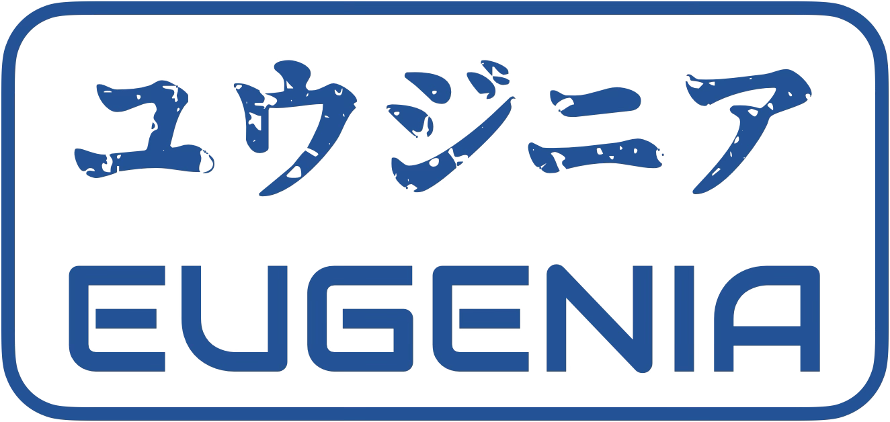

<!-- Copyright (C) 2025, Saqttra. All rights reserved.

This file is part of Saqttra Eugenia.

This source code is licensed under the MIT license
found in the LICENSE file in the root directory.

<https://github.com/saqttra/Eugenia>. -->


<div align='center'>
  <a href='https://github.com/saqttra/Eugenia'>
    
  </a>

  <h3>Eugenia</h3>

  <p>
    A C89 CLI tool that inspects and visualizes the internal byte and Unicode structure of files</p>
  </p>

  <p>
    <a href="./LICENSE.md"></a>
    <a href="https://github.com/saqttra/Eugenia/releases">
      
    </a>
  </p>
</div>

---

<br />

**Eugenia** is a command-line tool written in ANSI C that inspects and visualizes the internal byte and Unicode structure of text files.
It displays each character’s byte offset, UTF-8 width, code points, and visual representation — helping to understand text encoding.

### Installation

Clone the repository using your preferred method:

#### **HTTPS**

```bash
git clone https://github.com/saqttra/Eugenia.git
```

#### **SSH**

Use an SSH key (recommended if you have GitHub SSH access):

```bash
git clone git@github.com:saqttra/Eugenia.git
```

#### **GitHub CLI**

```bash
gh repo clone saqttra/Eugenia
```

Then build Eugenia with either **GCC** or **Clang**.
If you have **Make** installed, simply run:

```bash
make
```

This will produce the `eugenia` executable inside the project directory.
